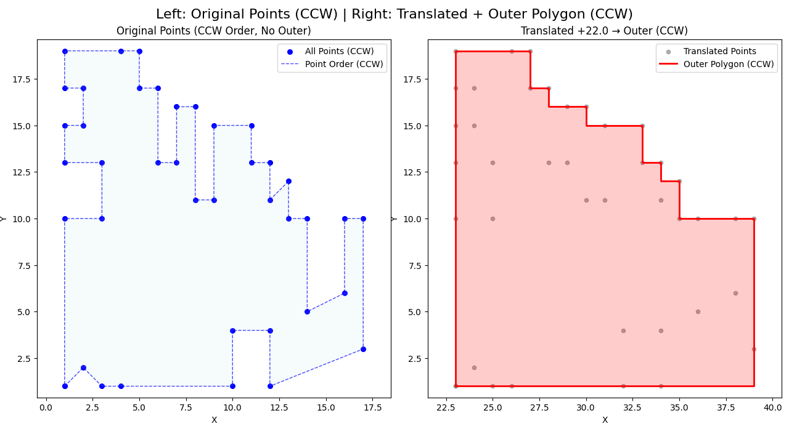

- en [English](README_EN.md)

# 外轮廓多边形提取算法

从 **多边形（逆时针）** 中提取 **最小外接凸阶梯多边形（外轮廓）** 的轻量级算法。

> **左侧**：原始点集（逆时针顺序）  
> **右侧**：平移后的点集 + 算法重新计算的外轮廓（逆时针闭合多边形）

---

## 特性

- **基于四角极值点定位 + 分边递归构建**，时间复杂度 `O(n log n)`（排序）+ `O(n)`（递归）
- 精确处理 **凹陷、共线、边界点**，不依赖 `scipy.spatial.ConvexHull`
- 输出 **闭合**、**逆时针** 的多边形顶点序列
- 提供 `matplotlib` 可视化示例（`test_points.py`）
- 仅依赖标准库 + `matplotlib`（可视化可选）

---
